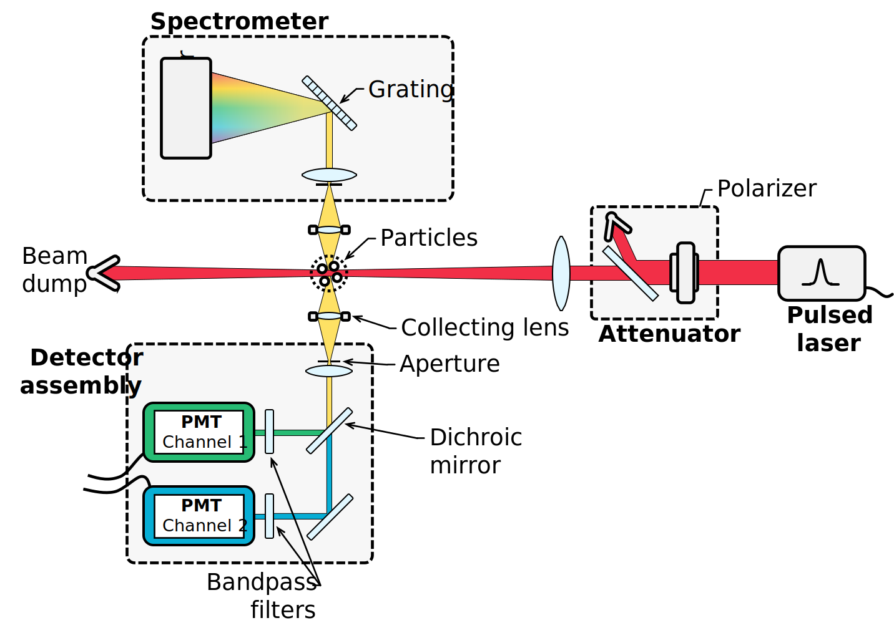

# MODULIIM

> NOTE: This code is an experimental code.

This code provides **modu**lar TiRe-**LII** **m**odelling tools in Python to interpret signals. Models are set up to take a range of properties as inputs, enabling rapid changes to optimization routines and uncertainty quantification including nuisance parameters.

This code is the next generation of a similar MATLAB code. 

This program is built to simulate signals from various materials, including soot, silicon, germanium, iron, silver, and molybdenum. Signals are generated predominantly using absorption, conduction, and evaporation submodels, with capabilities to do other cooling modes. A typical TiRe-LII apparatus is shown below ([Sipkens, 2017][SipkensThesis]; [Sipkens et al., 2022][SipkensReview]). 

  

-----------------------------------

### License

This software is licensed under an GPL-3.0 license (see the corresponding file for details).

[SipkensThesis]:https://uwspace.uwaterloo.ca/handle/10012/13860

[SipkensReview]:https://doi.org/10.1007/s00340-022-07769-z